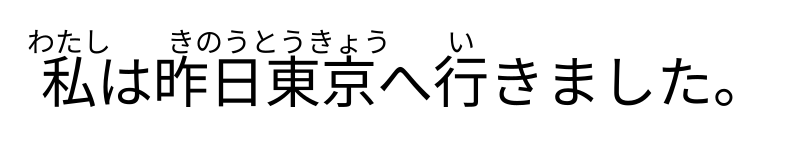

# YomiFont

**Automatic Japanese furigana at the font shaping layer.**

YomiFont is an experimental Japanese font that compiles lexical and
morphological reading rules into OpenType shaping tables to display automatic
furigana without modifying the underlying text or requiring a runtime analyzer.

Install the font, select it, and type ordinary Japanese:

```
わたし  きのう とうきょう    い
私は昨日東京へ行きました。
```

The characters in the document are still exactly `私は昨日東京へ行きました。`
Copy, search, select and index all continue to operate on the original text —
the furigana exists only as glyphs the shaping engine inserts.

No HTML `<ruby>`, no JavaScript, no browser extension, no MeCab at runtime,
no preprocessing of the user's text.



---

## Does it work?

Yes, with measured caveats. Everything below is reproducible from this repo.

| | |
|---|---|
| Lexical rules compiled into one font | **317,410** |
| Total glyphs | **9,275** |
| Ruby glyphs (reusable, all words share them) | **3,262** for 81 kana |
| Font size | **11.3 MB** (GSUB 9.2 MB) |
| Shaping cost | **0.51 µs/char** |
| OpenType Sanitizer (what Chrome/Firefox require) | **PASS** at every scale |
| Kanji tokens that receive ruby | **99.97 %** |
| …with the reading UniDic assigns in context | **92.4 %** |
| GPOS table | **none — the font has no GPOS at all** |

Reading accuracy is measured against UniDic over 20,000 Tatoeba sentences
disjoint from anything used to build the rules. Of the 7.6 % that disagree,
3.0 % are deliberate overrides, 2.9 % pick a different reading JMdict also
attests, and **1.0 % are genuinely wrong**.

The goal is not to force a reading onto every kanji. Readings that depend on
sentence meaning, and personal and place names, are out of reach of a font by
construction — [docs/limitations.md](docs/limitations.md) separates those walls
from the merely-unfinished engineering. `--abstain-margin` will emit no ruby
rather than guess on genuine ties.

## Quick start

```bash
uv venv --python 3.13 .venv
uv pip install --python .venv/bin/python fonttools uharfbuzz pytest
# optional, for the UniDic evaluation oracle and corpus priors
uv pip install --python .venv/bin/python fugashi unidic-lite opentype-sanitizer

make data          # fetch JMdict, Noto Sans JP, Tatoeba
make font          # dist/YomiFont-Regular.ttf
make test          # 194 shaping tests, HarfBuzz + CoreText
make eval          # reading accuracy against UniDic
make bench         # scaling benchmark, 1k -> 318k rules
```

Two builds are produced:

| file | rules | size | for |
|---|---|---|---|
| `dist/YomiFont-Regular.ttf` | 317,410 | 11.3 MB | desktop install |
| `dist/YomiFont-Web-Regular.ttf` | 50,000 | 2.2 MB | web embedding |

## How it works

```
JMdict ──► lexical IR ──► okurigana alignment ──► rules ──► GSUB ──► .ttf
                              ▲                     ▲
              UniDic corpus priors (optional)  conflict resolution
```

A word is recognised by a **ChainContextSubst** rule whose input is the whole
word. It triggers one **MultipleSubst** that replaces the word's first glyph
with *(the ruby kana for the whole word, then the first glyph again)*:

```
ccmp:  sub uni6771' lookup L uni4EAC' ;                      # 東京
L:     sub uni6771 by r.3068.tm1 r.3046.t1 r.304D.t3
                     r.3087.t5  r.3046.t7 uni6771 ;          # とうきょう + 東
```

The ruby glyphs are **zero-advance** and carry their own horizontal placement
inside the outline, so the base text keeps its exact metrics and **no GPOS is
needed**. The `t` suffix is the glyph's horizontal slot in quarter-ems:

```
t = 4·group_start + 2·span − n_kana + 2·i
```

Because placement is a function of that one integer, the same ~40 positional
variants of each kana serve every word in the lexicon. This is what keeps
317,410 rules inside 9,275 glyphs instead of blowing past the 65,535 limit —
one composite glyph per word would need 317,410 of them, 4.8x the limit.

Read [docs/architecture.md](docs/architecture.md) for the full design and
[docs/opentype-notes.md](docs/opentype-notes.md) for the OpenType details,
including three failure modes that cost real debugging time.

## Compatibility

| engine | status |
|---|---|
| HarfBuzz (CLI, uharfbuzz) | full |
| CoreText (macOS native) | full |
| Safari 26.5 / WebKit | full |
| Chrome 151 / Blink | full — **only because of a specific mitigation** |
| DirectWrite / Windows | not tested, see notes |

Blink itemises text into script runs before shaping, so **no GSUB rule can span
a Han↔Kana boundary in Chrome**: `行った` is shaped as `行` + `った`, and the
okurigana that disambiguates the reading is in a different run. Without a
mitigation this costs 20 percentage points of accuracy. YomiFont handles it by
deriving each single-kanji fallback rule from how that kanji is actually read
when it stands alone between kana. Full measurements in
[docs/compatibility.md](docs/compatibility.md).

## Repository layout

```
src/yomifont/       jmdict, kana, alignment, conjugation, rules,
                    engine (reference matcher), rubyglyphs, gsub, build
scripts/            pipeline.py, evaluate.py, build_priors.py
tests/shaping/      194 shaping tests (HarfBuzz + CoreText)
tests/integration/  browser harness and cross-engine comparison
benchmarks/         scaling benchmark and results
tools/ctshape/      a CoreText counterpart to hb-shape (Swift)
docs/               architecture, opentype notes, compatibility, limitations
```

## Licensing

YomiFont's own code is MIT. The build products carry obligations from their
sources:

- **JMdict** — CC BY-SA 4.0, © Electronic Dictionary Research and Development
  Group. Attribution is embedded in the font's `name` table and required in any
  redistribution.
- **Noto Sans JP** — SIL Open Font License 1.1. The Reserved Font Name rule is
  why this project is called *YomiFont* and not *Noto* anything.
- **UniDic / unidic-lite** — BSD/LGPL/GPL, build-time only; no UniDic data is
  embedded in the font.
- **Tatoeba** — CC BY 2.0 FR, build-time only.

Details and the exact obligations are in [docs/licensing.md](docs/licensing.md).

## Status

This is a research prototype, not a finished typeface. It does not attempt
perfect semantic disambiguation and will confidently put the wrong reading on
words that need context a font cannot see. See
[docs/limitations.md](docs/limitations.md) before using it for anything that
matters.
