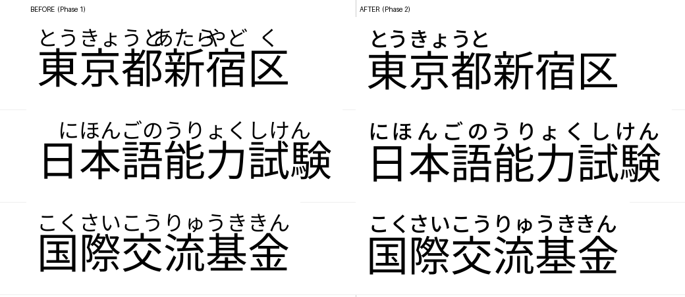

# YomiFont

**Japanese furigana at the font shaping layer.**

YomiFont compiles lexical and morphological reading rules into OpenType shaping
tables to display furigana without modifying the underlying text or requiring a
runtime analyzer.

It does this two ways:

| | |
|---|---|
| **Automatic Ruby** | YomiFont determines a safe reading from lexical data, and abstains when it cannot |
| **Explicit Ruby** | the author supplies the reading directly in the text: `｜月（ライト）` |

Install the font, select it, and type ordinary Japanese:

```
わたし  きのう とうきょう    い
私は昨日東京へ行きました。
```

The characters in the document are still exactly `私は昨日東京へ行きました。`
Copy, search, select and index continue to operate on the original text — the
furigana exists only as glyphs the shaping engine inserts.

No HTML `<ruby>`, no JavaScript, no browser extension, no MeCab at runtime, no
preprocessing of the user's text.


---

## What it is, precisely

> YomiFont displays furigana for lexical readings that can be safely determined
> at the font shaping layer, and intentionally abstains when the reading is
> ambiguous.

It is not automatic reading of arbitrary Japanese. Roughly a fifth of the kanji
tokens in ordinary prose get no ruby, on purpose, because nothing a shaping
engine can see determines their reading.

| | |
|---|---|
| **Precision** — of the readings it renders, how many are right | **99.96 %** |
| **Wrong readings** in 20,000 held-out sentences | **20** |
| Coverage — kanji tokens that receive ruby | 79.1 % |
| Coverage under Blink's script segmentation | 48.9 % (precision 99.87 %) |
| Safe lexical rules | 460,082 (incl. 153,745 place names) |
| Explicit-ruby rules (no vocabulary at all) | 128 |
| Total glyphs / ruby glyphs | 63,053 / 47,302 |
| Font size | 20.4 MB (GSUB 14.9 MB) |
| GPOS table | **none — the font has no GPOS at all** |
| OpenType Sanitizer (what Chrome and Firefox require) | PASS |

Measured against UniDic over Tatoeba sentences disjoint from anything used to
build the rules. [docs/safety.md](docs/safety.md) explains the policy and lists
every remaining wrong reading.

## Precision over coverage

A word gets ruby only when the lexical data determines its reading. The signal
is **entry identity**, not frequency:

```
今日  きょう / こんにち   one JMdict entry   -> variant readings -> ruby
市場  しじょう / いちば   two JMdict entries -> two words        -> no ruby
人気  にんき / ひとけ     two entries        -> no ruby
```

Corpus frequency is never used to pick a reading. It can tell you which is more
common; it cannot tell you the other is wrong.

Abstention is enforced, not merely omitted: an ambiguous sequence gets a
**block rule** that consumes it and emits nothing, so no shorter rule fires in
its place.

Proper nouns are included when their reading is determined — 東京, 富士山,
任天堂 — because the criterion is determinism, not lexical category.

## Explicit Ruby

For everything the automatic side gives up — ateji, 義訓, names, coined words,
or simply a reading you want — write it into the text:

```
   ライト        そら          マジ          とも
   月            宇宙          本気          強敵

｜月（ライト）  ｜宇宙（そら）  ｜本気（マジ）  ｜強敵（とも）
|月(ライト)     |宇宙(そら)     |本気(マジ)     |強敵(とも)
```

Both syntaxes are equivalent, and the markup disappears when it renders. The
explicit reading always wins:

```
東京           -> とうきょう      automatic
｜東京（エド）  -> エド            explicit, and the automatic reading is suppressed
```

Automatic ruby keeps working around it — `昨日、｜月（ライト）を見た。` sets
きのう over 昨日, ライト over 月 and み over 見.

**No dictionary is involved.** The rules match the *shape* of an expression —
how many base characters, how many ruby characters — so a base string the font
has never seen still takes a reading:

```
｜超絶暗黒剣（ダークネスブレード）
```

128 rules cover every combination up to **base ≤ 8, ruby ≤ 16**, over a
183-character kana alphabet, reusing the same ruby glyphs, the same layout and
the same three sizes as the automatic side. Out-of-range or malformed markup is
left visibly unchanged, never partly transformed.

The catch is Chrome: Blink itemises text into script runs before shaping, so
an expression that crosses a Han↔Kana boundary is never seen whole and gets no
ruby. Kana bases work; kanji bases do not — measured across 30 candidate
separators including joiners, variation selectors and PUA, none of which
bridges it. Chrome does at least suppress the automatic reading on an annotated
base, so it shows the markup rather than a reading the author replaced. Safari,
CoreText and HarfBuzz render all cases. [docs/explicit-ruby.md](docs/explicit-ruby.md) has the per-engine
measurements and the reasoning behind the limits.

## Typography



Ruby is laid out, not just placed: 均等割り付け distribution when the reading is
narrower than its base, tightened tracking before any size reduction, bounded
overhang only as a last resort, and ruby outlines taken from a heavier weight of
the variable base font to compensate for optical thinning at half size.

Group separation is measured from glyph geometry and asserted in the test suite:

| specimen | Phase 1 gap between ruby groups | now |
|---|---|---|
| 京都大学病院 | −0.068 em (overlapping) | +0.216 em |
| 国際交流基金東京 | −0.123 em (overlapping) | +0.158 em |
| 東京都新宿区 | −0.146 em (overlapping) | separated |

Details and the conventions honoured (and not) in
[docs/typography.md](docs/typography.md).

## Quick start

```bash
make venv          # virtualenv + dependencies
make data          # fetch JMdict, JMnedict, Noto Sans JP, Tatoeba
make font          # dist/YomiFont-Regular.ttf
make web           # dist/YomiFont-Web-Regular.ttf
make test          # 371 shaping tests, HarfBuzz + CoreText
make eval          # precision / coverage against UniDic
make eval-blink    # same, modelling Blink script segmentation
make visual        # typography contact sheet + metrics
make bench         # scaling benchmark, by rule count
make bench-explicit  # explicit ruby, by span length
make audit         # does every rule spell the reading it came from?
```

Two builds, because 16 MB is not a `@font-face` download:

| | rules | explicit-ruby bases | glyphs | size |
|---|---|---|---|---|
| `YomiFont-Regular.ttf` | 325,492 | 10,940 kanji | 63,053 | 16.1 MB |
| `YomiFont-Web-Regular.ttf` | 60,000 (longest) | 2,907 kanji (only what its rules use) | 50,126 | 5.5 MB |

The web build trims two things. Truncating the rule set costs automatic
coverage; skipping the widened kanji repertoire costs explicit *bases*, and
that is the bigger size lever — those extra outlines cost about 3.4 MB while
all 32,391 explicit ruby glyphs cost 0.7 MB, because ruby glyphs are
composites and kanji are not. Explicit ruby itself is present in both.

## How it works

```
JMdict (+JMnedict) ──► lexical IR ──► safety classifier ──► alignment
                                              │
                                              ▼
                                  rules ──► GSUB ──► .ttf
```

A word is recognised by a **ChainContextSubst** rule whose input is the whole
word, triggering one **MultipleSubst** that replaces the word's first glyph with
*(the ruby kana for the whole word, then the first glyph again)*. Ruby glyphs are
zero-advance and carry their placement inside the outline, so the base text keeps
its exact metrics and no GPOS is needed.

A ruby glyph's identity is `(kana, size, x offset)` and never the word it
appears in, which is what keeps 325,492 rules inside 63,053 glyphs instead of
past the 65,535 limit.

See [docs/architecture.md](docs/architecture.md) and
[docs/opentype-notes.md](docs/opentype-notes.md).

## Compatibility

| engine | status |
|---|---|
| HarfBuzz (CLI, uharfbuzz) | full |
| CoreText (macOS native) | full |
| Safari 26.5 / WebKit | full — matches HarfBuzz on every probe case |
| Chrome 151 / Blink | correct, but **half the coverage** |
| Firefox, DirectWrite, Word, LibreOffice, Adobe | not tested |

Blink itemises text into script runs before shaping, so no rule can span a
Han↔Kana boundary: `行った` is shaped as `行` + `った` and the okurigana that
identifies the verb is in a different run. YomiFont does not guess to make up
the difference — it abstains, so Chrome gets 48.9 % coverage at 99.87 %
precision. [docs/compatibility.md](docs/compatibility.md).

## Repository layout

```
src/yomifont/       jmdict, jmnedict, lexicon, safety, alignment, conjugation,
                    rules, engine, layout, rubyglyphs, gsub, build
scripts/            pipeline.py, evaluate.py
tests/shaping/      214 shaping tests (HarfBuzz + CoreText)
tests/visual/       typography contact sheets and geometric metrics
tests/integration/  browser harness and cross-engine comparison
benchmarks/         scaling benchmark and results
tools/ctshape/      a CoreText counterpart to hb-shape (Swift)
docs/               safety, typography, architecture, opentype, compatibility,
                    limitations, licensing, roadmap
```

## Licensing

Code is MIT. The font is a derivative work of JMdict/JMnedict (CC BY-SA 4.0,
EDRDG) and Noto Sans JP (SIL OFL 1.1) and must be redistributed under CC BY-SA
4.0 while honouring the OFL. "Noto" is a Reserved Font Name, which is why this
is called YomiFont. Full obligations in [docs/licensing.md](docs/licensing.md).

## Status

A research prototype. It will leave a fifth of the kanji in a page unannotated,
and for a common noun that is also somebody's name it can still be wrong. See
[docs/limitations.md](docs/limitations.md).
