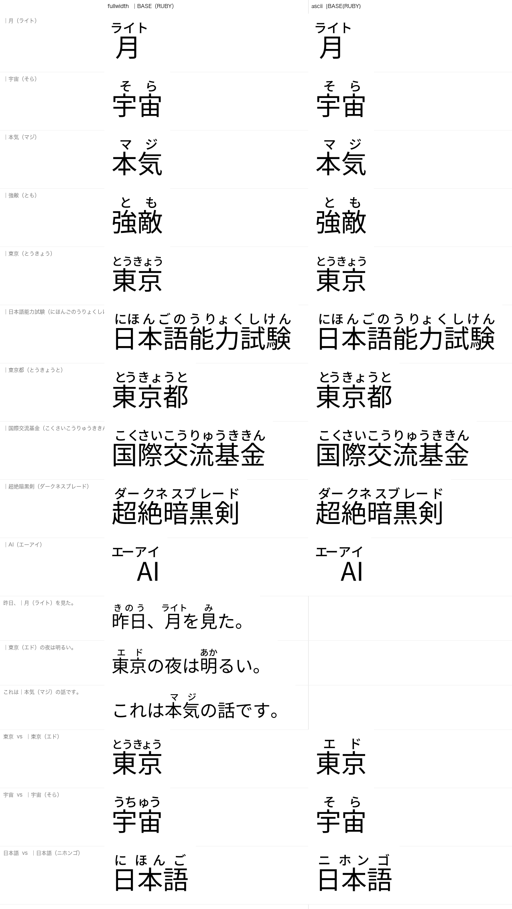

# Explicit Ruby

**The reading the user typed, rendered exactly, with no dictionary consulted.**

```
｜月（ライト）        ｜宇宙（そら）        ｜本気（マジ）        ｜強敵（とも）
|月(ライト)           |宇宙(そら)           |本気(マジ)           |強敵(とも)
```



Automatic Ruby answers *"what does this word read as?"* and abstains when the
lexical data does not determine it ([safety.md](safety.md)). Explicit Ruby does
not ask the question at all — the author has already answered it.

| | |
|---|---|
| Automatic Ruby | YomiFont derives a safe reading from JMdict/JMnedict, or renders nothing |
| Explicit Ruby | the author supplies the reading in the text; it is always rendered |

That makes it the escape hatch for everything the automatic side deliberately
gives up: ateji, 義訓 / manga readings, personal and place names, coined words,
and the ~21 % of kanji tokens where two dictionary entries share a spelling and
nothing visible to a shaping engine can choose between them.

---

## Syntax

    START  BASE  OPEN  RUBY  CLOSE

| role | fullwidth | ASCII |
|---|---|---|
| start of the base span | `｜` U+FF5C | `|` U+007C |
| end of base, start of ruby | `（` U+FF08 | `(` U+0028 |
| end of the expression | `）` U+FF09 | `)` U+0029 |

Both syntaxes compile to the same rules and produce **identical glyph
streams** — asserted in `tests/shaping/test_shaping.py::test_ascii_syntax_is_identical`,
and measured to itemise identically in every engine tested (see
[Engines](#engines)). The fullwidth form is the one to document to Japanese
readers because it can be typed without leaving the IME; the ASCII form exists
so nobody has to switch input mode.

The leading marker is what makes the base span unambiguous — it is never
inferred:

```
東京都｜新宿区（しんじゅくく）      base = 新宿区
｜東京都新宿区（とうきょうとしんじゅくく）   base = 東京都新宿区
```

**Parentheses alone never start ruby.** `月（ライトという意味）` is ordinary
text and stays ordinary text; only `｜` or `|` opens an expression. No escape
mechanism is needed for prose, and none is implemented.

---

## Explicit beats automatic

```
東京            ->  とうきょう      (automatic)
｜東京（エド）   ->  エド            (explicit; the automatic reading is suppressed)
｜猫（いぬ）     ->  いぬ            (not corrected, however wrong)
```

There is never automatic ruby *and* explicit ruby on one base. The two systems
are separate lookups in the same `ccmp` feature, and lookups run in LookupList
order over the whole buffer — so the explicit lookup cannot simply "consume"
its match and leave the automatic lookup nothing to do; the automatic lookup
gets its own pass regardless.

The explicit rule therefore swaps every base glyph for a **protected
duplicate** — an identical-looking glyph that is outside the automatic lookup's
Coverage and outside every rule's Input. Nothing can match there afterwards.
Only glyphs that can *begin* a lexical rule need a duplicate (4,490 of them),
because a rule that cannot start inside the span cannot match inside it.

Outside the span, automatic ruby is untouched:

```
昨日、｜月（ライト）を見た。
 きのう    ライト        み
```

---

## How it works

One `ChainContextSubst` rule matches a whole expression and carries one
`SingleSubst` record per position:

| position | record |
|---|---|
| `｜` | → `ruby.blank`, a zero-advance empty glyph |
| each base character | → its protected duplicate |
| `（` | → `ruby.blank` |
| each ruby character | → `r.<cp>.<size>.<slot>`, the shared ruby inventory |
| `）` | → `ruby.blank` |

Every record is 1:1, so the glyph count never changes and the sequence indices
stay addressable. That is the constraint `gsub.py` documents for the automatic
side: a record that inserts or removes glyphs invalidates the indices of the
records after it, and engines disagree about the details. Nothing here inserts.

A rule is selected by the *shape* of the expression — how many base characters,
how many ruby characters — never by their identity. There are `base_max ×
ruby_max` rules (128 at the defaults) and that is the entire rule set. **No
word list is involved**, which is why a base the font has never seen works:

```
｜超絶暗黒剣（ダークネスブレード）
｜未知語（オリジナルヨミ）
```

`Coverage` (format 3) rather than `ClassDef` (format 2), because a kana has to
be admissible in *both* spans — `｜本気（マジ）` has kana on one side,
`｜そら（ソラ）` on both — and a ClassDef can only put a glyph in one class.

### Where the ruby lands

The delimiters and the ruby glyphs are all zero-advance, so when the shaper
reaches the ruby characters the pen sits at exactly `B` em. Ruby character *i*
needs

    offset = layout.layout_group(0, B, reading)[i].x  −  B × EM

which depends only on `(B, N, i)` — never on which kana. That is what bounds
the inventory to `|alphabet| × |distinct (size, offset)|` instead of
`|all base/ruby pairs|`, and it is the same `layout` module, the same
`rubyglyphs` composites, the same three sizes, the same JLREQ even
distribution as the automatic side ([typography.md](typography.md)). There is
no second renderer and no GPOS table.

---

## Supported ruby characters

183 characters. Each one costs `|distinct (size, offset)|` glyphs — 177 at the
defaults — so this is the expensive axis.

| | |
|---|---|
| hiragana | U+3041–U+3096 (86), small kana and voiced/semi-voiced forms included |
| katakana | U+30A1–U+30FA (90), small kana and voiced/semi-voiced forms included |
| marks | `ー` `・` `ゝ` `ゞ` `ヽ` `ヾ` `〜` |

**Latin, digits and anything else the font can draw work as *base* characters
for free** — they are ordinary glyphs and need no new inventory:

```
｜AI（エーアイ）      ｜X（エックス）      ｜2026（にせんにじゅうろく）
```

Latin and digits *inside* the ruby are available behind `--explicit-latin`, and
are off by default because they are measured to cost another 62 × 177 = 10,974
glyphs for a case that Japanese ruby rarely needs. A ruby character outside the
alphabet does not partially render: the rule simply does not match and the
markup stays visible (`｜月（漢字）`).

The base repertoire is deliberately wider than the dictionary's. JMdict and
JMnedict between them use **5,055** kanji; Noto Sans JP can draw **13,313**.
Restricting explicit bases to the dictionary's own character set would remove
much of the feature's reason to exist, so the build spends whatever glyph
budget is left on the rest, Unified Ideographs first — **10,940 kanji** in the
shipping font, against 2,482 glyphs of remaining headroom. The ~2,370 that do
not fit are Extension A and compatibility ideographs; a base containing one of
them is left as visible markup rather than rendered wrong.

Those extra outlines are the single largest cost in the font — about **3.4 MB**,
against 0.7 MB for all 32,391 ruby glyphs, because a ruby glyph is a composite
and a kanji is not. `--no-explicit-bases` turns the widening off and is what
the web build uses; explicit ruby still works there, but only on characters the
rules already mention (2,907 kanji rather than 10,940).

---

## Limits

**base ≤ 8 characters, ruby ≤ 16 characters**, on a 1/10 em placement grid.

Input outside those limits is left visibly unchanged rather than partially
transformed, which is the same fail-safe path as malformed markup.

These are not round numbers picked for looking generous. A TrueType font
cannot address more than 65,535 glyphs, and the offsets have to span the whole
base span, so the distinct-offset count grows at roughly 20 slots per base
character and the glyph cost is that times the 183-character alphabet.

`make bench-explicit` measures the curve. Every row builds the *same* three
lexical rules, so the differences belong to explicit ruby alone. Shaping is
median µs/char, on text containing explicit markup and on text without it:

| base ≤ | ruby ≤ | grid | rules | pairs | glyphs | GSUB | build | shape (markup / plain) | OTS |
|---|---|---|---|---|---|---|---|---|---|
| 4 | 8 | 1/10 em | 32 | 68 | 26,736 | 0.06 MB | 5.3 s | 0.14 / 0.04 | PASS |
| 6 | 12 | 1/10 em | 72 | 123 | 36,801 | 0.10 MB | 7.9 s | 0.27 / 0.04 | PASS |
| **8** | **16** | **1/10 em** | **128** | **177** | **46,683** | **0.15 MB** | **10.8 s** | **0.45 / 0.04** | **PASS** |
| 10 | 20 | 1/10 em | 200 | 231 | 56,565 | 0.21 MB | 13.4 s | 0.66 / 0.04 | PASS |
| 12 | 24 | 1/10 em | 288 | 287 | 64,551 | 0.27 MB | 16.0 s | 1.00 / 0.04 | PASS |
| 8 | 16 | 1/20 em | 128 | 299 | 64,552 | 0.25 MB | 15.5 s | 0.43 / 0.04 | PASS |
| 8 | 16 | 3/20 em | 128 | 124 | 36,984 | 0.11 MB | 8.1 s | 0.43 / 0.04 | PASS |
| 8 | 16 | 1/5 em | 128 | 97 | 32,043 | 0.09 MB | 7.0 s | 0.43 / 0.04 | PASS |
| 16 | 32 | 1/5 em | 512 | 202 | 51,258 | 0.25 MB | 14.2 s | 1.73 / 0.04 | PASS |
| 32 | 64 | 1/5 em | — | 1,566 | 75,030 ruby glyphs alone | — | — | — | **cannot build** |

Three things fall out of that:

* **Carrying the feature is free when it is not used.** Text with no markup
  shapes at 0.04 µs/char in every configuration, including the one with 512
  rules. The expression lookup's Coverage is `｜` and `|`, so every other glyph
  is rejected on the first check.
* **Shaping markup costs about 3.5 ns per rule**, because a `｜` scans the
  rule list. 128 rules is 0.45 µs/char; 512 is 1.73.
* **The wall is glyphs, not GSUB.** The whole feature is 0.15 MB of GSUB. The
  32,391 ruby glyphs are what runs out of room.

Read the `glyphs` column as a lower bound, not as the shipping figure. Those
rows carry three lexical rules, so they leave out what the automatic side
costs: 14,486 ruby glyphs of its own and 4,490 protected duplicates. Add those
and **base 8 / ruby 16 is the largest configuration that still fits** — base 10
/ ruby 20 would land past the ceiling:

```
shipping font   63,053 glyphs   2,482 spare   15.25 MB (GSUB 8.93 MB)   OTS PASS
```

A 1/20 em grid — what the automatic side uses — cannot reach base 7, and
`｜日本語能力試験（にほんごのうりょくしけん）` is base 7. Coarsening the grid
to 1/10 em is what buys base 8, and it is **measured not to cost typography**:
over every realistic `(base, ruby)` combination the worst spacing deviation is
0.313 and the median 0.096, against **0.520 and 0.118 for the automatic side**
on the same metric. Explicit ruby is, if anything, slightly more evenly set.

One thing this depends on: offsets are snapped with halves rounding **up**, not
with `round()`. Every layout offset is already a multiple of the 1/20 em
quantum, so on a 1/10 em grid *every* offset sits exactly on a half; banker's
rounding alternates direction along a reading and turns an evenly spaced group
uneven — ライト over 月 came out at 400/600 unit steps instead of 500/500.

---

## Engines

Measured, not assumed. Reproduce with:

```bash
./tests/integration/server.py &
open http://127.0.0.1:8777/tests/integration/explicit_probe.html
```

An explicit expression only shapes if the whole `START BASE OPEN RUBY CLOSE`
run reaches GSUB in **one** shaping call. Engines that itemise a text node into
script runs before shaping may split it at a script boundary, and then no rule
can match.

| engine | fullwidth | ASCII | whole expression in one run | notes |
|---|---|---|---|---|
| HarfBuzz 14.2.1 | yes | yes | yes | reference; the client chooses the run |
| CoreText (macOS 26.x) | yes | yes | yes | glyph stream identical to HarfBuzz |
| Safari 26.6.2 / WebKit | **yes, 18/18** | **yes, 18/18** | yes | all cases, both syntaxes |
| Chrome 152 / Blink | **partial, 6/18** | **partial, 6/18** | only within one script | see below |
| Firefox | not tested (not installed) | | | |
| DirectWrite / Windows | not tested (no Windows host) | | | |

**The two syntaxes are exactly equivalent.** Every engine treats `｜月（ライト）`
and `|月(ライト)` the same way — fullwidth punctuation buys nothing over ASCII
for itemisation, and ASCII costs nothing. Neither is more portable.

### Chrome / Blink: the base must be kana

Blink itemises into script runs before shaping, the same behaviour that halves
the automatic side's coverage ([compatibility.md](compatibility.md)). The
delimiters are Script=Common and attach to whatever is next to them, so:

```
｜月（ライト）    ->  ｜月（ | ライト）        Han | Katakana   -- split, no ruby
｜つき（ツキ）    ->  ｜つき（ツキ）           one run          -- works
```

Measured, per case:

| expression | Chrome |
|---|---|
| `｜つき（つき）` hiragana base | works |
| `｜ツキ（ツキ）` katakana base | works |
| `｜つき（ツキ）` hiragana base, katakana ruby | works — **Blink does not split Hiragana from Katakana** |
| `｜月（ライト）` Han base | no ruby, markup stays visible |
| `｜月（つき）` Han base | no ruby |
| `｜AI（エーアイ）` Latin base | no ruby |

So in the **shipped** design, explicit ruby is available for kana bases and not
for kanji bases — which is the majority of what the feature is for.

That is a property of the shipped *rules*, not of Blink. It was reported here
as a structural impossibility; that was wrong, and the correction is below.

### A kanji base IS reachable in Blink

The shipped rule needs the whole expression at once, which Blink never
provides. Split it in two and each half works inside its own run:

```
run 1   ｜BASE（     hide the delimiters, keep the base
run 2   RUBY）｜     hide the close and the marker, set the kana
```

Measured, and demonstrated: `make_split_font.py` builds it and
`split_demo.html` renders `｜月（ライト）｜`, `｜東京（エド）｜` and
`｜日本語能力試験（にほんごのうりょくしけん）｜` in Chrome 152 with the reading
over the kanji and the markup gone, while `私（わたし）` and `価格（税別）` stay
untouched. Single-run engines produce an identical glyph stream, so it is one
design rather than two.

Three things it costs, all measured rather than assumed:

* **A trailing marker.** Without it run 2's rule is `KANA+ CLOSE`, which is
  also what ordinary parenthesised kana looks like, and swallowing 私（わたし）
  is not acceptable. The marker must sit *after* a kana to land in run 2 — a
  Common character before the kana joins the Han run instead.
* **Ruby is right-aligned to the base end, not centred.** Centring needs the
  base width. Run 2 can be *moved* rather than told: a negative XAdvance on the
  last glyph of run 1 shifts where run 2 starts, and Chrome honours that across
  the run boundary (`shift_probe.html` — `kern`, `dist` and `mark` all work).
  But whatever run 1 subtracts, something must add back to keep the line
  correct, and only run 1 knows how much, so the shift buys nothing. Run 2's
  origin is necessarily the base end.
* **A defect that is not yet solved.** Run 1's rule needs the leading `｜`,
  which is Script=Common, so after kana it is absorbed into the preceding run
  and run 1 never matches. The ruby still draws, so the expression renders
  half-done — reading present, delimiters visible. A non-Common marker would
  fix it, which means an ideograph and an ugly syntax.

It is a prototype, not shipped: adopting it is a syntax change
(`｜月（ライト）｜`) and a typography change (right-aligned, fixed pitch, no
均等割り付け and no size step-down), and that is a product decision.

### The fail-safe

The failure used to be safe but not silent: the base was left unclaimed, so it
picked up its *automatic* reading and Chrome rendered `｜宇宙（そら）` as the
literal markup with **うちゅう** over 宇宙 — a correct dictionary reading, but
not the one the author chose.

That is now suppressed. Blink never shows one rule the whole expression, but
the itemization matrix ([compatibility.md](compatibility.md)) shows the
*prefix* `｜BASE（` **is** one run, because Common-script characters join the
Han run. The font carries a second, weaker family of rules matching that prefix
alone; they claim the base span and do nothing else — no delimiter is hidden,
no ruby is emitted — so the expression fails atomically:

```
                       Safari / CoreText / HarfBuzz    Chrome
                               そら
｜宇宙（そら）                   宇宙                    ｜宇宙（そら）
```

Those rules are last in the lookup. Subtables are tried in order, so wherever
the full expression matched it has already consumed the span and the fail-safe
never runs.

**It depends on the left context, and this is measured.** `｜` is
Script=Common and attaches to the run *before* it, so when an expression
follows kana the marker is absorbed there and the Han run starts at the base
without it:

| context | fail-safe |
|---|---|
| `｜宇宙（そら）` alone | works |
| `星｜宇宙（そら）` after kanji | works |
| ` ｜宇宙（そら）` after a space | works |
| `）｜宇宙（そら）` after punctuation | works |
| `の｜宇宙（そら）` after hiragana | **does not** — うちゅう returns |
| `ア｜宇宙（そら）` after katakana | **does not** |
| two expressions in a row | **does not** — the first ends in kana |

It is never *worse* than before, and it holds in the contexts where an
expression starts a phrase. An author who needs the override to hold
everywhere should not rely on the font alone in Blink.

The ASCII syntax gets no fail-safe at all: `|月(` is SPLIT in Blink where
`｜月（` is SAME_RUN. That is the one measured behavioural difference between
the two syntaxes, and it is why the fullwidth form is the recommended one.

### A correction to the Phase 2 Chrome finding

`compatibility.md` previously carried an open issue: Chrome 152 appeared to
render the Phase 2 font's ruby "not at all (0 pixels)". That reproduces
reliably — **in the canvas probe**. It is a property of the probe, not of
Chrome: Chrome's canvas 2D text path does not apply `ccmp` for these fonts,
while its DOM path does. Screenshotting the same strings in the DOM shows
Phase 2 ruby rendering correctly, identically to Phase 1.

`explicit_probe.html` therefore measures two independent signals — the DOM
inline-box width and the drawn ink extent — because neither engine is reliable
on both: Chrome collapses the DOM box but draws nothing on canvas, WebKit draws
correctly on canvas but reports the *unshaped* inline-box width.

---

## Malformed markup

Broken markup is left exactly as typed — visible, unshaped, never partially
transformed. `tests/shaping/corpus.py::EXPLICIT_MALFORMED` asserts the glyph
stream is byte-identical to the no-GSUB stream for each of:

```
｜月（ライト        ｜月ライト）        ｜（ライト）        ｜月（）
｜（）              ｜月                月（ライトという意味）
|月(ライト          |月ライト)          a|b|c              f(x) = |x| + 1
｜月（漢字）         ｜一二三四五六七八九（あ）   ｜月（あいうえお…と）
```

This is structural rather than defensive: the rule requires all five parts to
be present with the right classes, and a `ChainContextSubst` that does not
match does nothing at all.

**Nested markup is unsupported** (§15) and behaves predictably rather than
safely-by-accident. `｜A（｜B（あ））` matches the *inner* expression — no rule
can match at the outer `｜`, because `｜B（` are not ruby characters — so it
renders as `｜A（` + `B` with ruby `あ` + `）`, with the outer markup left
literal. Nothing becomes invisible.

---

## Line breaking

An explicit expression is not protected against a line break falling inside it.
`（` (Line_Break=OP) prevents a break directly after it and `）` (CL) prevents
one directly before it, but breaks between the kana of a long reading are
permitted by UAX #14 and no font table can forbid them.

If a break does land inside, both halves shape independently, neither matches,
and **both render as the literal markup** — the same fail-safe path as
malformed input. Nothing is dropped, and ruby never ends up on a different line
from its base.

Authors who need the guarantee should say so in the host, not in the font:

```html
<span style="white-space: nowrap">｜日本語能力試験（にほんごのうりょくしけん）</span>
```

---

## Text integrity

Shaping never modifies the character buffer, so the document still contains the
markup the author typed:

```
copy / select / search    ｜月（ライト）        (not 月, not 月ライト, not PUA)
advance width             1 em                  (the base span, nothing else)
cluster values            every glyph maps back to a source index
```

This is the deliberate trade. The markup is *visually* absent but *textually*
present, so copying a passage out of a document yields the source form rather
than the rendered form. That round-trips losslessly, but it will surprise
anyone expecting to copy `月`. A companion tool converting between `｜月（ライト）`
and `<ruby>月<rt>ライト</rt></ruby>` would be a reasonable thing to have; it is
deliberately **not** part of the font, and the font never depends on one.

The three delimiters map to a zero-advance empty glyph, so the cursor has
zero-width positions at those indices — arrow-key navigation still visits them,
because the characters are still there.

---

## Known limitations

1. **Chrome renders explicit ruby only for kana bases.** Structural; see above.
2. **base ≤ 8, ruby ≤ 16.** Longer expressions stay visible as markup.
3. **Ruby characters are kana only** by default. Latin/digits behind a flag.
4. **A line break inside an expression disables it** for that occurrence.
5. **`|BASE(RUBY)` can collide with ordinary ASCII text.** `|foo(bar)` will not
   fire — `f`, `o`, `o` are not in the ruby alphabet — but a construct like
   `|x(あ)` in a code sample would. The fullwidth syntax has no such collision
   and is the recommended one.
6. **No escaping.** A literal `｜月（ライト）` that should *not* become ruby
   cannot currently be written. Ordinary prose is unaffected because
   parentheses alone never start an expression.
7. **Vertical writing blanks explicit ruby**, as it does automatic ruby: the
   offsets are baked into the outlines as horizontal displacements. The
   delimiters still disappear, so tategaki shows the base text without markup
   and without ruby.
