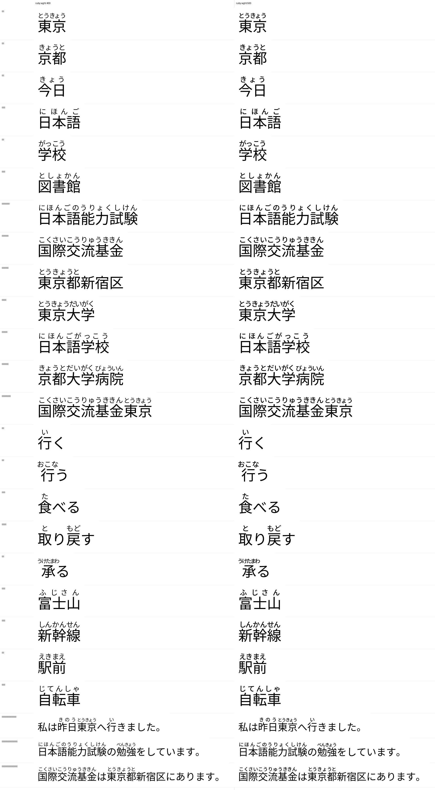

# Ruby typography

Phase 1 proved the mechanism and set ruby the only way a fixed formula can:
every kana at a half-em pitch, the group centred on its base. That is
mechanically correct and typographically poor. This document is what replaced
it, why, and what a font can and cannot honour from the Japanese ruby
conventions.

## What was wrong, measured

Group separation is measurable from glyph geometry — take each ruby group's ink
bounding box and look at the gap to the next one. `tests/visual/specimens.py`
does this; negative means the groups overlap.

| specimen | Phase 1 min group gap | Phase 2 |
|---|---|---|
| 東京都新宿区 | **−0.146 em** | separated |
| 京都大学病院 | **−0.068 em** | **+0.216 em** |
| 国際交流基金東京 | **−0.123 em** | **+0.158 em** |
| 私は昨日東京へ行きました。 | +0.198 em | +0.277 em |

Ruby-to-base clearance was 0.017–0.027 em; it is now 0.055–0.068 em.

## The conventions, and which ones a font can keep

Sources consulted: JIS X 4051 (日本語文書の組版方法), the W3C
[Japanese Layout Requirements](https://www.w3.org/TR/jlreq/), and
[CSS Ruby Annotation Layout](https://www.w3.org/TR/css-ruby-1/).

| convention | status |
|---|---|
| ruby ~0.5 em of the base | **kept** (0.5 em default) |
| 均等割り付け — even distribution when ruby is narrower than base, end gaps half the inter-character gap | **kept**, `layout._distribute` |
| group ruby (グループルビ) for jukujikun | **kept** — a kanji run is one group, never split per character |
| mono-ruby (モノルビ) per character | **not attempted** — needs per-character readings the data does not give for jukujikun |
| jukugo-ruby (熟語ルビ) — per-character within a compound, group at the edges | **not attempted**, same reason |
| ruby overhang into adjacent characters, permitted only when the neighbour is kana without its own ruby | **approximated** — the font cannot see the neighbour, so overhang is a bounded last resort (see below) |
| ruby never overhangs a character that has its own ruby | **enforced structurally** by the containment policy |
| line-breaking rules around ruby | **out of reach** — the host application breaks lines |

## The layout cascade

`src/yomifont/layout.py`. For each group, given a base span of `M` characters
and a reading of `n` kana, try in order:

1. **Fit inside the span** at the largest size, distributed 均等割り. This
   leaves end insets automatically, which is what keeps neighbouring groups
   apart.
2. **Fit inside with tightened tracking**, down to 86 % of the nominal pitch.
   Kana ink is narrower than its em box, so slight negative tracking is
   invisible. This is the 東京都 case: six kana over three characters is
   *exactly* 3.0 em, and without this step the group butts straight against the
   next word's ruby — the defect visible in the image above.
3. **Step the size down** (0.50 → 0.44 → 0.38) and retry 1–2.
4. **Only then overhang**, up to 0.25 em per side.
5. Last resort for a long reading on one kanji (承る → うけたまわ): smallest
   size, spread across the overhang box.

The default policy is `contain` — prefer shrinking to overhanging. A font has
no way to know whether the next word carries ruby of its own, so a group that
stays inside its own base span can never collide with anything.
`POLICY_OVERHANG` reverses steps 1 and 4 for comparison.

## Why the placement grid got finer

A ruby glyph's identity is `(kana, size, x offset)`. Phase 1 quantised x to a
quarter em, which makes distribution impossible — there is nowhere to put a
kana between two lattice points. Phase 2 uses a twentieth of an em and three
sizes.

| | Phase 1 | Phase 2 |
|---|---|---|
| placement grid | 250 units (¼ em) | 50 units (1/20 em) |
| ruby sizes | 1 | 3 (0.50 / 0.44 / 0.38) |
| ruby glyphs | 3,262 | 14,194 |
| total glyphs | 9,275 | 19,849 |
| glyf table | 1.87 MB | 1.96 MB |

The inventory still saturates — it is a function of the grid and the size set,
not of the rule count — and 19,849 glyphs is comfortably inside the 65,535
limit. The cost is 90 kB of `glyf`, because every variant is a nested composite
of about 14 bytes.

## Ruby stroke weight

Scaling a Regular kana to half size scales its stroke weight with it, and the
result reads noticeably lighter than the body text it sits above — the optical
compensation a real type family builds into its small sizes. Because the base
is a variable font, the fix is nearly free: ruby outlines are taken from a
**wght 500** instance while the body stays at 400.

## Vertical metrics

| | value |
|---|---|
| ruby baseline | y = 940 |
| tallest ruby ink (ざ at 0.5 em) | y = 1373 |
| `hhea.ascent` / `OS/2.usWinAscent` / `sTypoAscender` | 1400 |
| descent | −288 |
| default line box | **1.688 em** |
| ink span, ruby top to descender bottom | 1.455 em |

`USE_TYPO_METRICS` is set so applications that honour it get the same box.
Because the line advance (1.688 em) exceeds the ink span (1.455 em),
consecutive lines cannot overlap at `line-height: normal`; a host that forces
line-height below ~1.46 em will collide, which is a property of the metrics
rather than something the font can prevent.

## Lexical grouping is separate from visual grouping

A rule may match several words' worth of text, but each *ruby group* comes from
one kanji run in the okurigana alignment, and each group is laid out
independently over its own span. That is why 取り戻す renders と over 取 and もど
over 戻 rather than one とりもどす smear, and why adjacent words keep visible
gaps.

Long compounds that JMdict holds as a single entry (日本語能力試験 →
にほんごのうりょくしけん) stay one group, because that is what the lexicon says
the unit is. Splitting them into sub-word groups would require per-component
readings the entry does not contain.

## Regression testing

- `tests/visual/specimens.py` renders every specimen through hb-view and emits
  `tests/visual/metrics.json`: group count, minimum inter-group gap, ruby-to-base
  clearance, maximum overhang, and spacing evenness.
- `tests/shaping/test_shaping.py::test_ruby_groups_do_not_collide` asserts the
  minimum gap is positive from glyph geometry, so the Phase 1 defect cannot
  come back silently.

## Not done

- Mono-ruby and jukugo-ruby.
- Per-kana optical spacing (う, し, っ and the small kana are visually lighter
  than their boxes suggest; a class-based nudge would even them out).
- Vertical writing: ruby is blanked under `vert`/`vrt2` rather than placed, so
  tategaki has no furigana.
- Ruby-specific outlines. Weight compensation is applied, but the shapes are
  still the text kana; a真 ruby cut would open the counters further.
